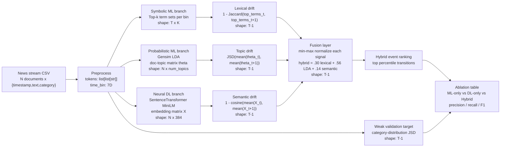

# Phase 3 Hybrid Architecture



## Fusion Mechanism

The hybrid score is not a simple vote across disconnected models. Each model
describes a different failure mode:

- Lexical drift catches exact-term spikes but misses paraphrases.
- LDA drift captures interpretable topic-mixture movement but can blur short
  texts.
- MiniLM embedding drift catches semantic changes even when vocabulary changes.

The fusion layer aligns all three signals on identical adjacent time-bin
transitions, normalizes them within the same held-out run, and computes a
weighted score:

```text
Hybrid(t -> t+1) =
  0.30 * normalized_lexical_drift +
  0.56 * normalized_lda_jsd +
  0.14 * normalized_embedding_cosine_drift
```

The ablation mode removes components and evaluates the same transitions against
a weak real-data target: shifts in HuffPost editor category distribution. This
does not pretend categories are perfect topic labels; it gives a reproducible
external signal for whether detected transitions correspond to real editorial
mix changes.
