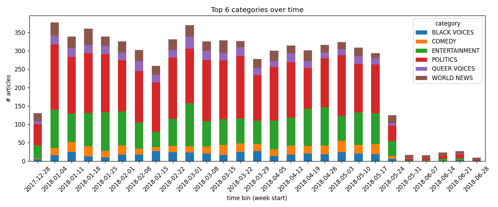
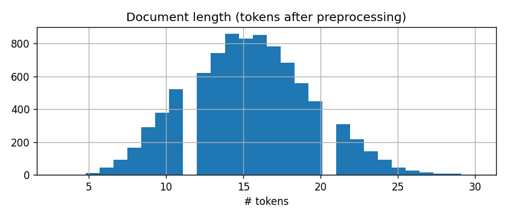

# Dynamic Trend & Event Detector — Phase 1 Report

## Abstract

We built a pipeline that detects and tracks evolving topics in a news article stream. Three approaches are compared: frequency/TF-IDF baselines, LDA topic models, and sentence-embedding clustering. We use the News Category Dataset (HuffPost, ~210k articles) as our real-world data source.

## 1. Data

We use the **News Category Dataset** from Kaggle (Rishabh Misra), containing ~210,000 news headlines and short descriptions from HuffPost spanning 2012–2022. Each article has a timestamp and one of 42 category labels (POLITICS, ENTERTAINMENT, WELLNESS, etc.).

For initial experiments we work with a 6-month subset (Jan–Jun 2018) to keep runtimes manageable. The text field combines the headline and short description for richer content.

### 1.1 Exploratory plots (EDA)

Before choosing preprocessing, we inspect the sample with `python scripts/eda.py` (from the repo root, after `download_data.py`). That script creates **two PNG files** in `docs/`:

- `docs/categories_over_time.png` — stacked bar chart of article counts per week for the six most common categories  
- `docs/doc_lengths.png` — histogram of token counts per document after preprocessing  

Those files **are not created by** `src.main`; they only exist after you run `eda.py` (or if someone commits them for you). Until then, the image links below will be broken in Markdown viewers.

**Category mix over time** — stacked counts per week for the six most frequent editor categories. This shows that the stream is not static: different weeks emphasize different sections, which motivates time-binned baselines and drift metrics.



**Document length (tokens)** — distribution after tokenization and stopword removal. Most headlines + descriptions are short; we avoid aggressive stemming because lengths are already modest.



*If the images do not render in your viewer, run `python scripts/eda.py` once so the PNG files exist next to this report, or open `docs/categories_over_time.png` and `docs/doc_lengths.png` directly.*

## 2. Preprocessing

- Lowercasing, regex tokenization, stopword removal (sklearn's English list)
- Short tokens (< 2 chars) dropped
- No stemming/lemmatization — headlines are short and already pretty clean

### 2.1 Chronological train / test split

All three model paths use the **same** time-based split so metrics are comparable and models are not fit on “future” news when we score test behavior.

- **Default (2018 H1 sample):** train = **[2018-01-01, 2018-05-01)** (Jan–Apr), test = **[2018-05-01, 2018-07-01)** (May–Jun). End dates are **exclusive**.
- Override via CLI: `--train-start`, `--train-end`, `--test-start`, `--test-end` (ISO dates).

**Baselines:** Jaccard for **train** and **test** separately (adjacent windows within each period). Example top terms are from the **test** period.

**LDA:** Trained on **train** only. **Train** and **test** log-perplexity; $u\_mass$ coherence on **train**; topic-mix **JSD** on **test** time bins only.

**Embeddings:** *k* from silhouette on **train**; K-Means fit on **train**, **test** labels via `predict`; silhouette on **train** and **test**. We also report **NMI/ARI** between clusters and HuffPost editor **categories** (weak labels, not semantic topics). On the test window we report **mean adjacent cosine distance** between **weekly bin centroids** of L2-normalized embeddings as a simple semantic drift signal.

## 3. Methods

### 3.1 Baselines

- **Frequency**: count top-k terms per 7-day window
- **TF-IDF**: treat each window as one document, rank terms by TF-IDF weight

We measure lexical drift between adjacent windows using Jaccard similarity on the top-15 term sets (computed per split).

### 3.2 LDA

- Gensim's `LdaModel` with `alpha=auto`, `eta=auto`, fit on **training** documents only
- **Train** and **test** log-perplexity; $u\_mass$ coherence on **train**
- Mean document–topic vector per **test** time bin; **JSD** between adjacent **test** bins

LDA treats each document as a mixture of topics and each topic as a distribution over words. Test perplexity checks fit on **held-out** time; coherence checks interpretability (Mimno et al.).

### 3.3 Embeddings + Clustering

- Encode with `all-MiniLM-L6-v2` (frozen SentenceTransformer; no fine-tuning). MiniLM is a compact bi-encoder suited to short news text and runs on CPU for course-scale subsets.
- *k* from best silhouette on **train** (e.g. k in 2..6)
- K-Means on **train** only; **test** cluster assignments via `predict`; silhouette on train and test
- **Validation:** **NMI** and **ARI** vs dataset `category` on train/test (clusters need not equal categories; metrics are permutation-invariant).
- **Temporal semantics:** mean adjacent **cosine distance** between per-bin embedding centroids on the **test** period (complements lexical Jaccard and LDA topic JSD).

### 3.4 Event detection (simple)

- Lexical spikes: adjacent-bin **Jaccard drift** on top-frequency terms vs a percentile threshold.
- LDA spikes: adjacent-bin **JSD** on mean topic mixtures under a percentile threshold.
- Lightweight **labels** from churn terms / topic words plus optional **dominant category** in the event window.

## 4. Results

Results are from the 6-month 2018 subset. Exact numbers depend on the window size and number of topics.

| Metric | Baselines | LDA | Embeddings |
|--------|-----------|-----|------------|
| Jaccard (train / test windows) | per split | — | — |
| Coherence (u_mass, train) | — | (typical negative u_mass range) | — |
| Perplexity (log, train / test) | — | both reported | — |
| Topic JSD (test bins) | — | reported | — |
| Silhouette (train / test) | — | — | both reported |
| Chosen *k* | — | — | from train silhouette |
| NMI / ARI vs category | — | — | train + test |
| Semantic bin drift (test) | — | — | mean adjacent cosine centroid distance |
| Events (lexical / LDA) | — | — | spike + simple labels |

## 5. Discussion

- Baselines show moderate lexical overlap between windows, confirming some topic continuity
- LDA finds interpretable topics but coherence varies with K
- The DL path uses a standard **pretrained encoder + shallow clustering**: strong baselines for short text without training a Transformer from scratch
- NMI/ARI quantify overlap between **clusters** and **editor categories**; low ARI is expected when categories do not match latent narrative structure
- Lexical Jaccard, LDA topic JSD, embedding centroid drift, and spike events give complementary views of change over time

## 6. Limitations

- Using only a 6-month subset for speed (full CSV available via `scripts/download_data.py`)
- No hyperparameter tuning beyond basic k-selection and fixed LDA topic count
- Encoder is **frozen**; fine-tuning would be a separate project phase
- KMeans assumes spherical clusters which may not fit news categories well

## 7. Next Steps

- Grid search for LDA num_topics
- Optional: embedding-based event spikes (centroid drift thresholding)
- Full dataset experiments with batched encoding if needed

## Reproducibility

**Core pipeline** (what you need whenever you run the project):

```bash
pip install -r requirements.txt
python scripts/download_data.py
python -m src.main --mode all
pytest tests/
```


```bash
python scripts/eda.py
```

If the PNGs are committed in `docs/`, readers see the figures without re-running EDA. Re-run `eda.py` only when those inputs change or the images are missing.
